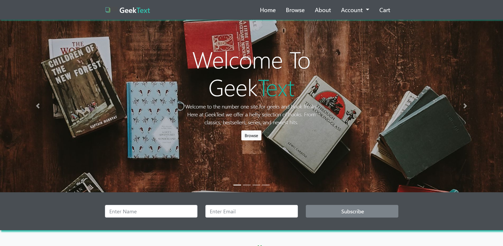
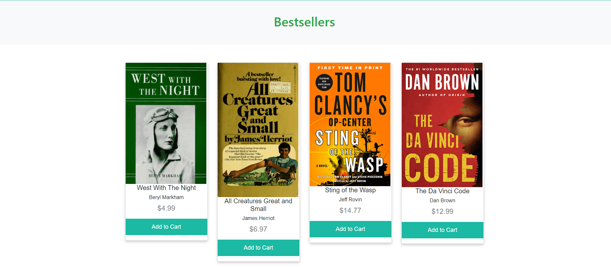
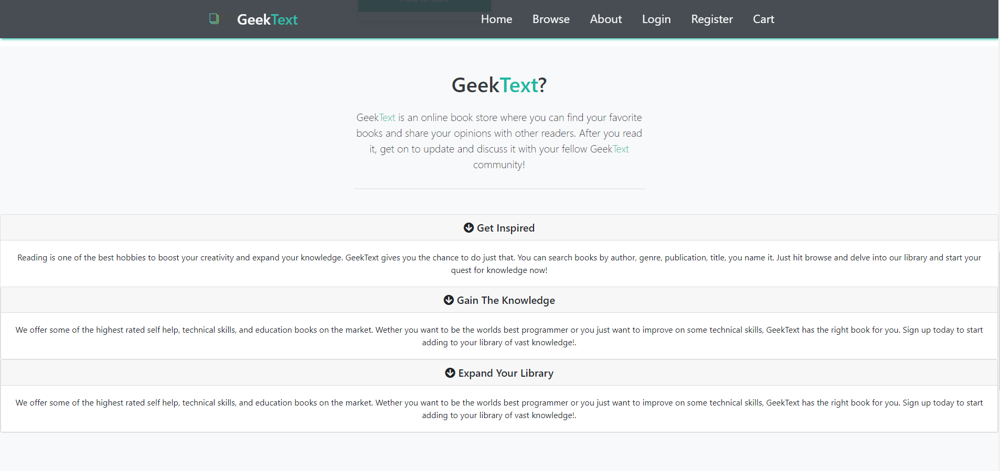
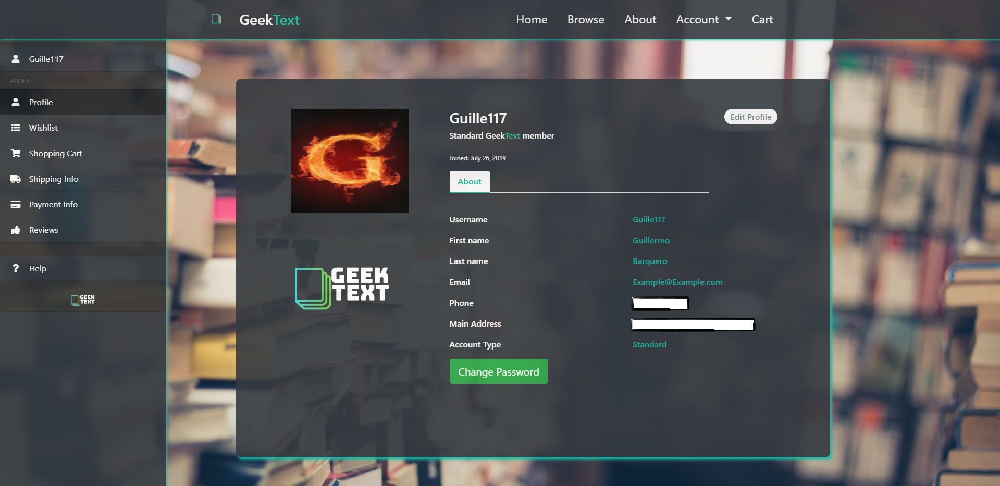
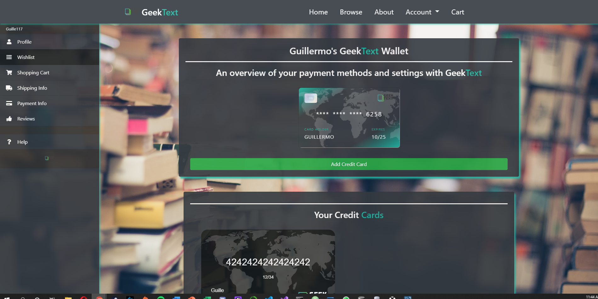
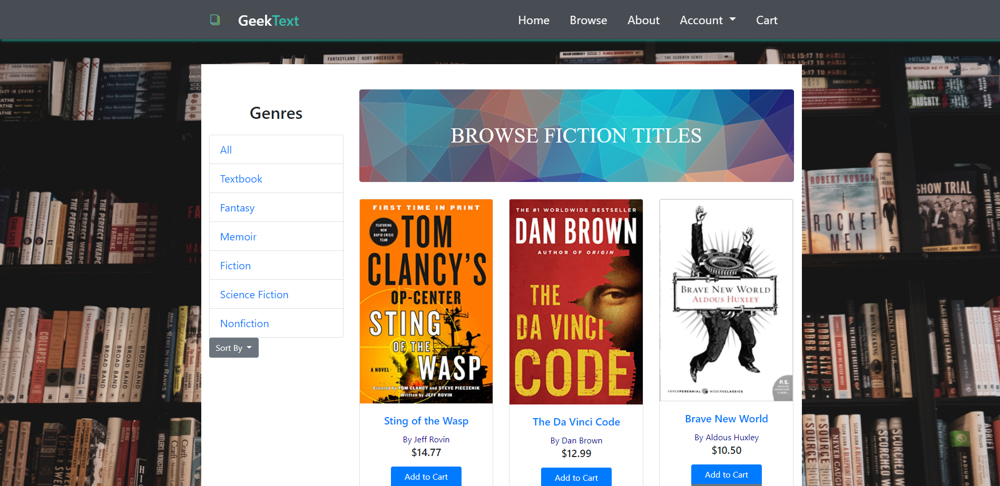

# GeekText_Team2

Online web application bookstore which targets a particular niche in technology. This website was created for 'CEN 4010 Software Engineering 1' and is a mock website that mimics a fully functioning website (excluding functioning payment/transactions)

# Technologies

This website was built using the python microframework called Flask. We utilized Flask and flaskalchemy to handle our database interactions from the application level. We stored our bookstore information on a MySQL local database.

- Python/Flask
- Bootstrap
- HTML/CSS/JS

# GeekText Images

## Homepage

## Bestsellers

## About

## Login

## Registration

## Profile

## Payment

## Browse

